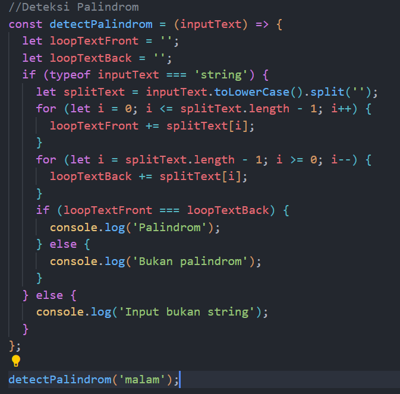
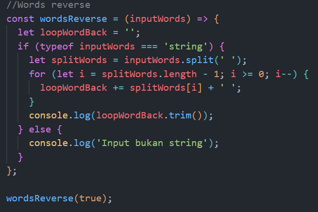
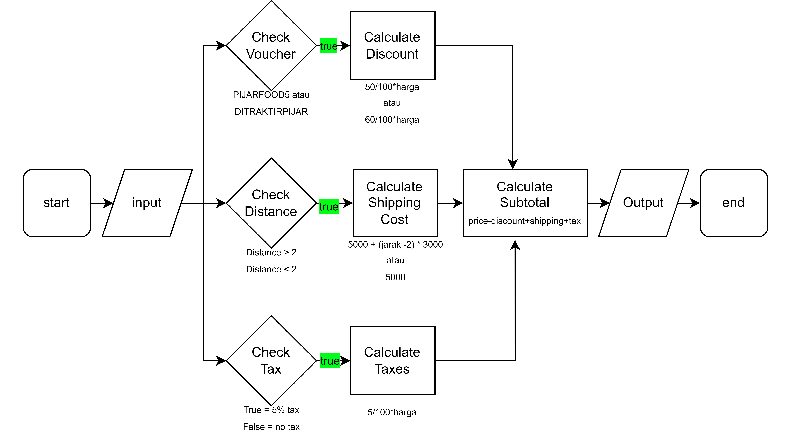
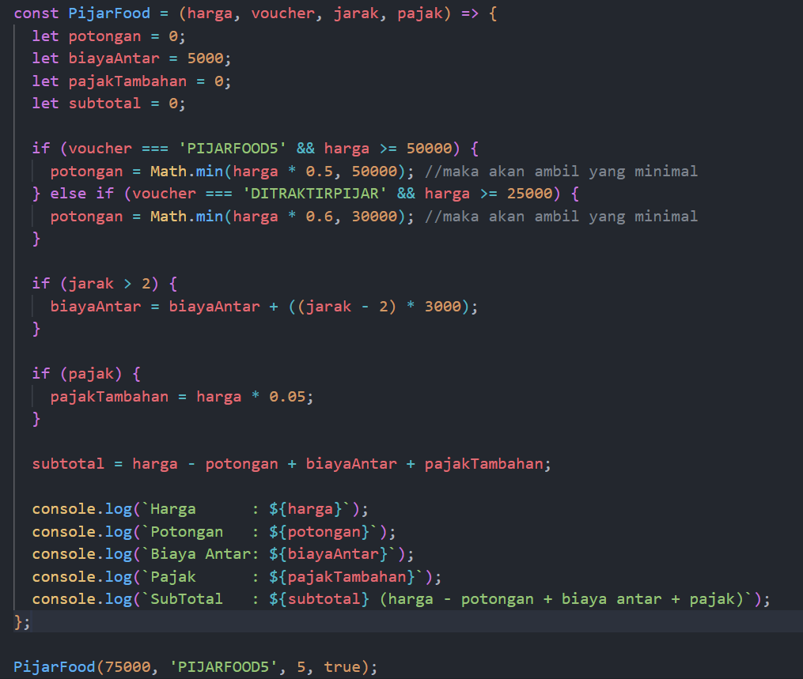
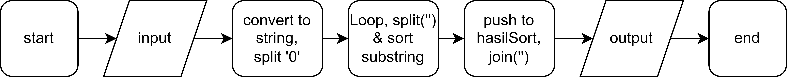
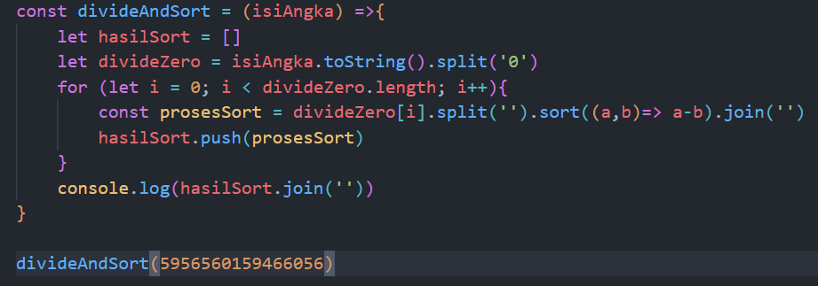

<h1>Exercise - Code Implement</h1>
<h2>Nomor 1</h2>
<h3>a. Code Deteksi Palindrom</h3>

<h3>b. Code Words Reverse</h3>

 
 
 
 
<h2>Nomor 2</h2>
<h3>Flowchart Pijar Food</h3>

<h3>Algoritma Pijar Food</h3>
<ol>
    <li>Mulai</li>
    <li>Memeriksa jenis voucher dan harga untuk menghitung potongan yang sesuai</li>
    <li>Memeriksa jarak untuk menghitung biaya antar yang sesuai</li>
    <li>Memeriksa apakah perlu menghitung pajak</li>
    <li>Menghitung subtotal berdasarkan harga, potongan, biaya antar, dan pajak</li>
    <li>Mencetak hasil harga, potongan, biaya antar, pajak, dan subtotal</li>
    <li>Selesai</li>
</ol>
<h3>Code Pijar Food</h3>

 
 
 
 
<h2>Nomor 3</h2>
<h3>Flowchart Divide and Sort</h3>

<h3>Algoritma Divide and Sort</h3>
<ol>
    <li>Mulai</li>
    <li>Mengonversi input menjadi string dan membaginya dengan menggunakan pemisah '0'</li>
    <li>Melakukan perulangan untuk setiap elemen, memecah setiap elemen menjadi array karakter substring, mengurutkannya.</li>
    <li>Memasukkan proses sortir ke dalam array hasil sortir</li>
    <li>Menggabungkan semua elemen dalam hasil sortir menjadi satu dengan join kemudian ubah lagi ke number dengan parseInt</li>
    <li>Mencetak hasilnya</li>
    <li>Selesai</li>
</ol>
<h3>Code Divide and Sort</h3>
