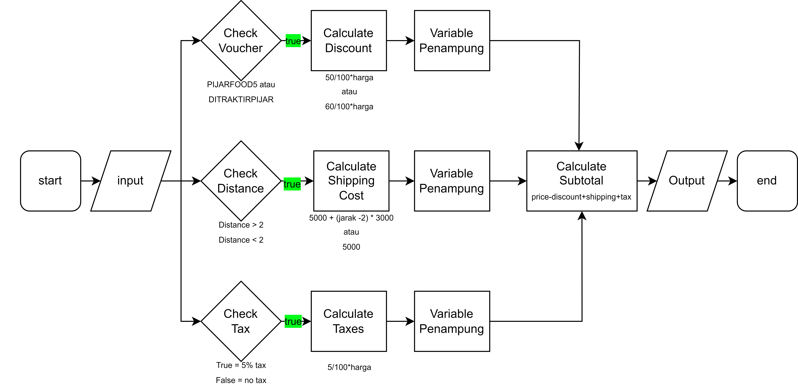
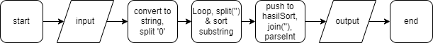

# Exercise - Code Implement
## Nomor 1
### a. Code Deteksi Palindrom

```
const detectPalindrom = (inputText) => {
  let loopTextFront = '';
  let loopTextBack = '';
  if (typeof inputText === 'string') {
    let splitText = inputText.toLowerCase().split('');
    for (let i = 0; i <= splitText.length - 1; i++) {
      loopTextFront += splitText[i];
    }
    for (let i = splitText.length - 1; i >= 0; i--) {
      loopTextBack += splitText[i];
    }
    if (loopTextFront === loopTextBack) {
      console.log('Palindrom');
    } else {
      console.log('Bukan palindrom');
    }
  } else {
    console.log('Input bukan string');
  }
};

detectPalindrom('Kasur ini rusak');
```

### b. Code Words Reverse

```
const wordsReverse = (inputWords) => {
  let loopWordBack = '';
  if (typeof inputWords === 'string') {
    let splitWords = inputWords.split(' ');
    for (let i = splitWords.length - 1; i >= 0; i--) {
      loopWordBack += splitWords[i] + ' ';
    }
    console.log(loopWordBack.trim());
  } else {
    console.log('Input bukan string');
  }
};
```
<br>
<br>
<br>
<br>

## Nomor 2
### Flowchart Pijar Food


### Algoritma Pijar Food
<ol>
    <li>Mulai</li>
    <li>Memeriksa jenis voucher dan harga untuk menghitung potongan yang sesuai</li>
    <li>Memeriksa jarak untuk menghitung biaya antar yang sesuai</li>
    <li>Memeriksa apakah perlu menghitung pajak</li>
    <li>Hasil hitung rumus masukkan ke variabel penampung</li>
    <li>Menghitung subtotal berdasarkan harga, potongan, biaya antar, dan pajak dengan memanggil variabel penampung</li>
    <li>Mencetak hasil harga, potongan, biaya antar, pajak, dan subtotal</li>
    <li>Selesai</li>
</ol>

### Code Pijar Food

```
const PijarFood = (harga, voucher, jarak, pajak) => {
  let potongan = 0;
  let biayaAntar = 5000;
  let pajakTambahan = 0;
  let subtotal = 0;

  if (voucher === 'PIJARFOOD5' && harga >= 50000) {
    potongan = Math.min(harga * 0.5, 50000); //maka akan ambil yang minimal
  } else if (voucher === 'DITRAKTIRPIJAR' && harga >= 25000) {
    potongan = Math.min(harga * 0.6, 30000); //maka akan ambil yang minimal
  }

  if (jarak > 2) {
    biayaAntar = biayaAntar + ((jarak - 2) * 3000);
  } 

  if (pajak) {
    pajakTambahan = harga * 0.05;
  }

  subtotal = harga - potongan + biayaAntar + pajakTambahan;

  console.log(`Harga      : ${harga}`);
  console.log(`Potongan   : ${potongan}`);
  console.log(`Biaya Antar: ${biayaAntar}`);
  console.log(`Pajak      : ${pajakTambahan}`);
  console.log(`SubTotal   : ${subtotal} (harga - potongan + biaya antar + pajak)`);
};

PijarFood(75000, 'PIJARFOOD5', 5, true);
```

<br>
<br>
<br>
<br>

## Nomor 3
### Flowchart Divide and Sort


### Algoritma Divide and Sort
<ol>
    <li>Mulai</li>
    <li>Mengonversi input menjadi string dan membaginya dengan menggunakan pemisah '0'</li>
    <li>Melakukan perulangan untuk setiap elemen, memecah setiap elemen menjadi array karakter substring, mengurutkannya.</li>
    <li>Memasukkan proses sortir ke dalam variabel penampung hasil sortir</li>
    <li>Menggabungkan semua elemen dalam hasil sortir menjadi satu dengan join kemudian ubah lagi ke number dengan parseInt</li>
    <li>Mencetak hasilnya</li>
    <li>Selesai</li>
</ol>

### Code Divide and Sort

```
const divideAndSort = (isiAngka) =>{
    let hasilSort = []
    let divideZero = isiAngka.toString().split('0')
    for (let i = 0; i < divideZero.length; i++){
        const prosesSort = divideZero[i].split('').sort((a,b)=> a-b).join('')
        hasilSort.push(prosesSort)
    }
    console.log(parseInt(hasilSort.join('')))
}

divideAndSort(5956560159466056)
```